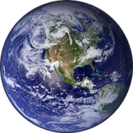

# Earth3D

Earth 3D realtime renderer. Was written to understand how shaders work in Unity3D. The whole project has one sphere with some shaders on it. **Prebuilt EXE** can be downloaded form **"Releases".**

### Features
- Sun imitation
- Earth rotation
- Atmosphere glowing
- Clouds
- Normal maps (mountines  cast shadows)
- Lights from cities on dark side of the Earth
- Rotation/zoom controlled by mouse
- Any visual settings can be disabled at runtime

### Requirements
- Windows 7 or newer

### Screenshots

